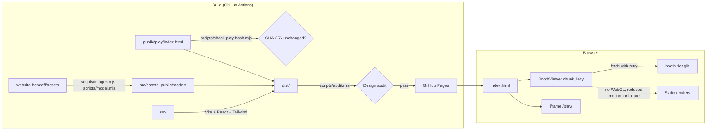

# Kerb Sense

Wait, and you get there first.

Kerb Sense is a free browser game and a six-month schools programme. The safest way to cross is also the best way to score. This repository holds the public website and the game.

- Website: https://driftsprits-stack.github.io/kerb-sense/
- Game: https://driftsprits-stack.github.io/kerb-sense/play/
- Project: Delta Challenge 2026, Track B, Road Safety Education. Team: TEAM if raeann cared.

## What is in this repository

| Path                     | What it is                                                                                                          |
| ------------------------ | ------------------------------------------------------------------------------------------------------------------- |
| `public/play/index.html` | The game. One file. It is not changed by the website. CI checks its SHA-256.                                        |
| `src/`                   | The website: React, TypeScript, Tailwind tokens.                                                                    |
| `src/lib/`               | Pure logic with unit tests: views, explode offsets, grid state, retry and budget.                                   |
| `src/booth/`             | The 3D booth viewer (react-three-fiber) and its static fallback.                                                    |
| `scripts/`               | Build-time tools: images, model compression, the gameplay clip, the design audit, the sitemap, the game hash check. |
| `tests/`                 | Playwright end-to-end tests with axe-core, and screenshot tests.                                                    |
| `docs/`                  | Compliance matrix, legal review, disaster recovery, ADRs and screenshots.                                           |
| `website-handoff/`       | The design system, the content brief, the standards, the research notes and the plan.                               |

## How to run it

You need Node 22.

```sh
npm ci
npm run dev          # http://localhost:5173/kerb-sense/
npm run build        # builds dist/, runs the design audit and writes the sitemap
npm run preview      # serves dist/ at http://localhost:4173/kerb-sense/
```

## How to test it

```sh
npm run check:play   # the game file is unchanged
npm run lint
npm run typecheck
npm test             # unit tests with coverage
npm run test:e2e     # Playwright, against the built site
npm run lhci         # Lighthouse CI, against dist/
```

## How to regenerate the assets

```sh
npm run assets       # renders and parts to WebP and AVIF; the GLB with meshopt; favicons; og:image
npm run clip         # records a real gameplay clip with Playwright and ffmpeg
```

The sources for the assets are in `website-handoff/assets/`.

## How it is deployed

Every push to `main` runs `.github/workflows/pages.yml`. It builds the site and deploys `dist/` to GitHub Pages. The base path is `/kerb-sense/`. See `docs/DR.md` for the restore steps.

## Architecture



## Design rules

The design system is in `website-handoff/DESIGN.md` and the standards are in `website-handoff/WEBSITE-STANDARDS.md`. In short: seven colours plus the paper ground, Helvetica Neue only, big type with a full stop, a 12-column grid, no gradients, shadows, opacity animation or rounded corners. `scripts/audit.mjs` fails the build if the built CSS breaks these rules.

## Licence

See `LICENSE`. The game, renders, logo and text belong to the Kerb Sense team.
