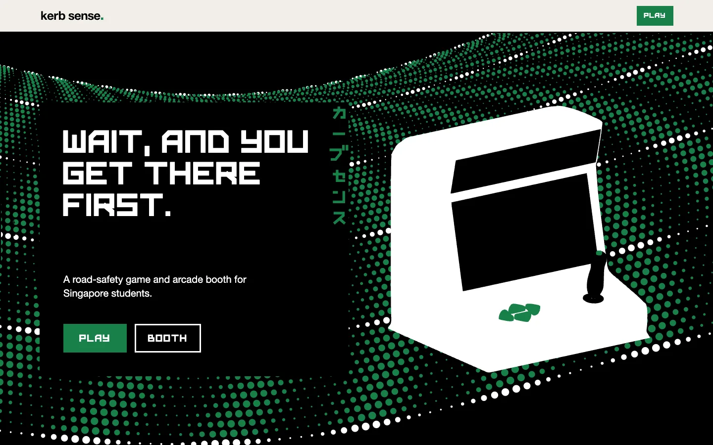
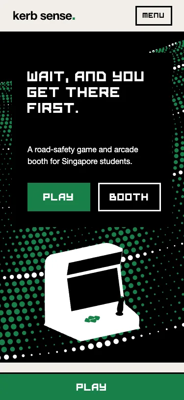
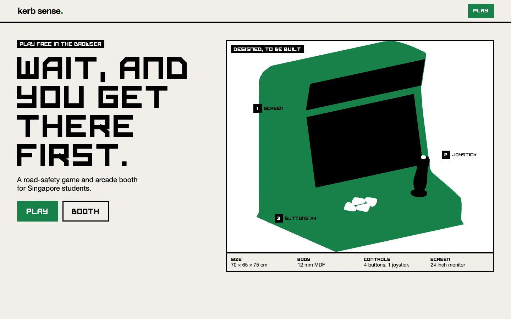
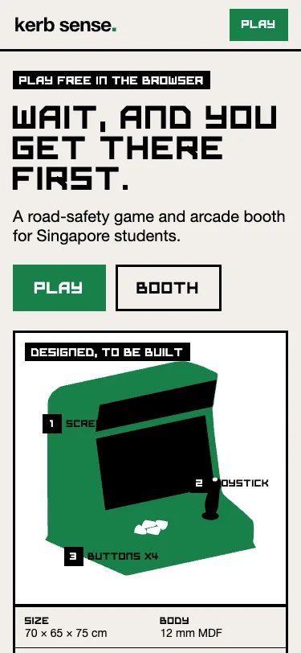
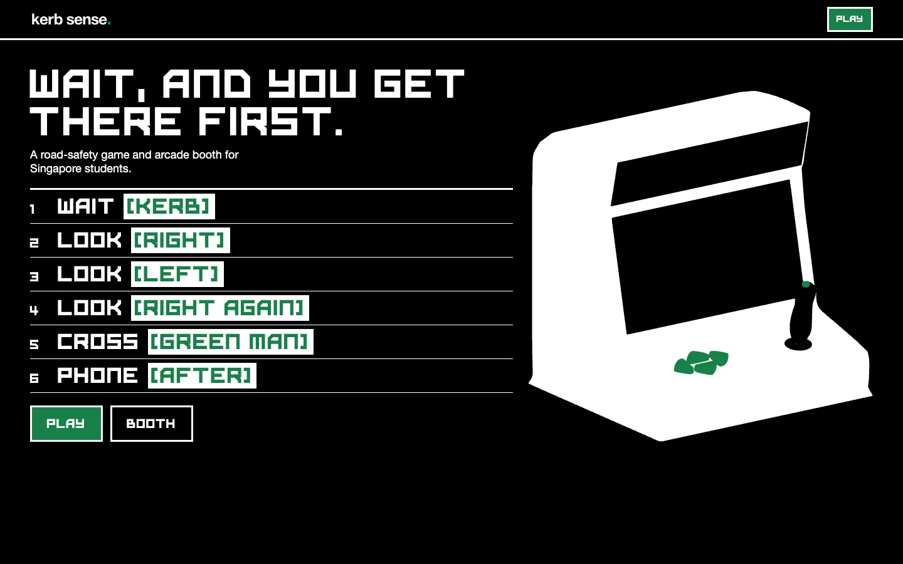
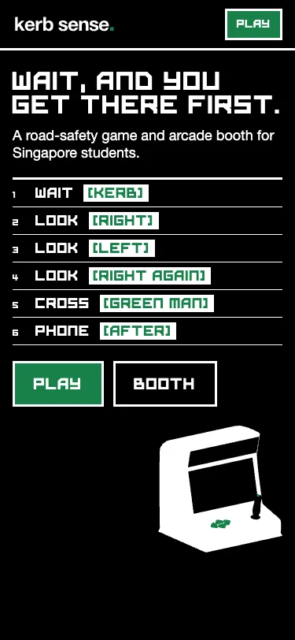

# Hero layout explorations (website shortlist pick 26)

Three constrained alternatives for the first screen, compared at 375 and 1440 px. All three use the same copy, the same four colours and the same booth artwork; only the composition changes. These are static layouts for a decision, not production code.

- **A. Poster hero** is the live site (`src/sections/Hero.tsx`).
- **B. Industrial catalogue** and **C. Numbered crossing guide** are mockups in this folder (`b-catalogue.html`, `c-guide.html`).

Re-render all six images with `npm run preview` running, then:

```bash
PW_CHROMIUM_PATH="/Applications/Brave Browser.app/Contents/MacOS/Brave Browser" SHOTS_BASE=http://localhost:4174/kerb-sense/ node scripts/explore-heroes.mjs
```

|              | 1440 × 900                          | 375 × 812                         |
| ------------ | ----------------------------------- | --------------------------------- |
| A. Poster    |     |     |
| B. Catalogue |  |  |
| C. Guide     |      |      |

## What each one does well, and what it costs

|                                                         | A. Poster                                             | B. Catalogue                                                                            | C. Guide                                                                                                        |
| ------------------------------------------------------- | ----------------------------------------------------- | --------------------------------------------------------------------------------------- | --------------------------------------------------------------------------------------------------------------- |
| First screen at 375 shows what, who, the booth and PLAY | Yes                                                   | Yes (the booth starts below the buttons)                                                | Yes (the booth is small)                                                                                        |
| Strongest for                                           | Brand and memory: the one dramatic moment on the site | Judges and school organisers: size, parts and "Designed, to be built" before any scroll | Students: the actual habit is taught before any scroll                                                          |
| Weakness                                                | Says the least about the booth itself                 | The calmest; least emotion. Repeats the booth section, which would then need to shrink  | Dense. The green bracket words are under 24 px on phones, against the colour rule. Repeats the crossing stepper |
| Motion it suits                                         | The LED drift (already live)                          | Callouts that light up in turn                                                          | Each step lighting up in order                                                                                  |
| Cost to adopt                                           | None                                                  | Medium: new hero, shorter booth section                                                 | Medium: new hero, change the crossing section                                                                   |

## Recommendation

Keep **A**. It is the only one with a single dominant image, and the sections below already do B's and C's jobs (the booth tour and the crossing dial). If the judges' first impression becomes the priority, **B** is the strongest alternative: move its status tag and spec strip into the hero and drop them from the booth section, so the page does not get longer. C's running order already lives in the crossing section as the stepper.
